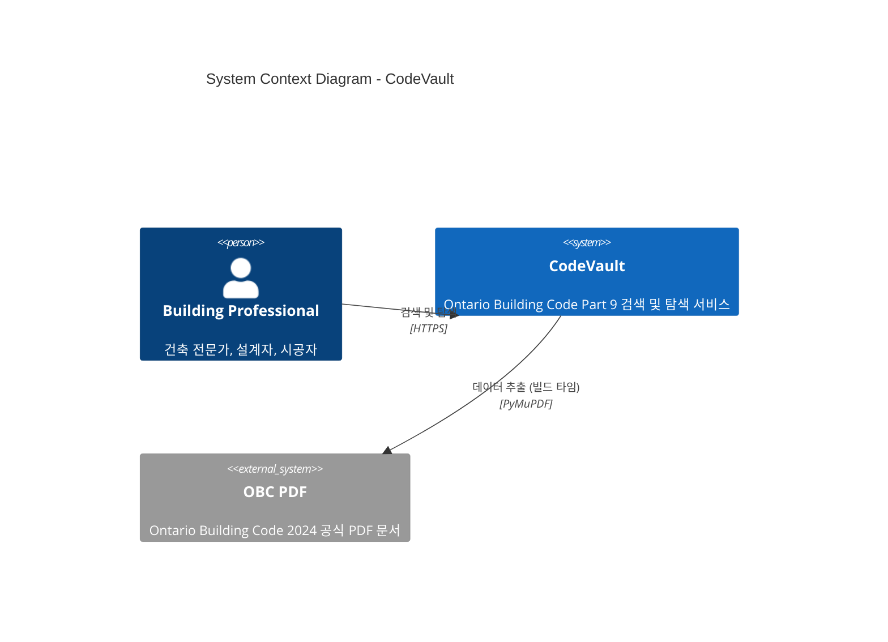
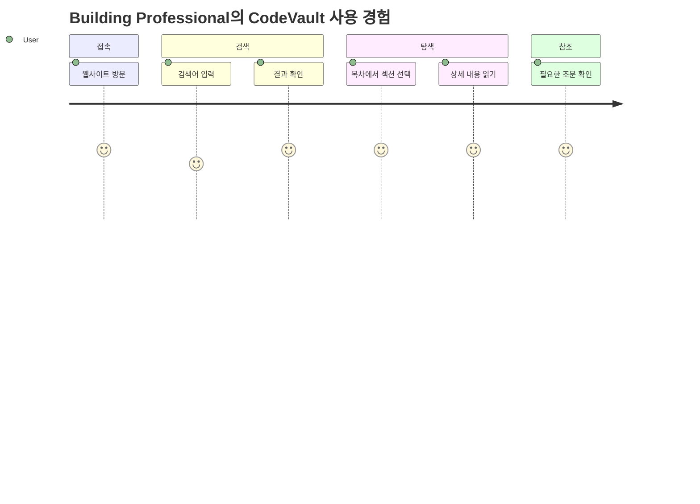

# System Context (C4 Level 1)

> CodeVault 시스템의 전체적인 맥락과 외부 시스템과의 관계

---

## System Context Diagram



### Text Representation

```
┌─────────────────────────────────────────────────────────────────────────┐
│                         SYSTEM CONTEXT                                  │
├─────────────────────────────────────────────────────────────────────────┤
│                                                                         │
│    ┌─────────────────┐                                                  │
│    │ Building        │                                                  │
│    │ Professional    │                                                  │
│    │ (User)          │                                                  │
│    └────────┬────────┘                                                  │
│             │                                                           │
│             │ 검색, 탐색                                                │
│             │ (HTTPS)                                                   │
│             ▼                                                           │
│    ┌─────────────────┐         빌드 타임        ┌─────────────────┐    │
│    │                 │◀─────────────────────────│                 │    │
│    │   CodeVault     │      데이터 추출         │   OBC PDF       │    │
│    │   (웹 앱)       │      (PyMuPDF)           │   (외부 소스)   │    │
│    │                 │                          │                 │    │
│    └─────────────────┘                          └─────────────────┘    │
│                                                                         │
└─────────────────────────────────────────────────────────────────────────┘
```

---

## Actors & External Systems

### 1. Primary Actor: Building Professional (건축 전문가)

| 속성 | 설명 |
|------|------|
| 역할 | 건축사, 시공자, 인스펙터, 학생 |
| 목표 | OBC Part 9 규정 검색 및 참조 |
| 상호작용 | 웹 브라우저를 통한 검색/탐색 |
| 기대사항 | 빠른 검색, 정확한 결과, 읽기 쉬운 포맷 |

### 2. External System: OBC PDF

| 속성 | 설명 |
|------|------|
| 유형 | 외부 데이터 소스 (Static) |
| 파일 | `301880.pdf` (Part 9) |
| 출처 | Ontario Building Code 2024 Compendium |
| 상호작용 | 빌드 타임에 Python으로 파싱 |
| 데이터 포함 | 조문 텍스트, 목차, 테이블, 수식 |

---

## System Boundaries

### In Scope (범위 내)

- Part 9 Building Code 검색
- 계층적 목차 탐색
- 수학 공식 렌더링 (KaTeX)
- 테이블 표시
- 클라이언트 측 검색

### Out of Scope (범위 외)

- 사용자 인증/계정 시스템
- Part 9 외 다른 Part 지원
- 코드 비교/버전 관리
- PDF 원본 다운로드
- 외부 API 연동

---

## User Journey



### 주요 사용 시나리오

1. **직접 검색**: 검색창에 키워드 입력 → 관련 조문 목록 → 상세 보기
2. **목차 탐색**: 사이드바 목차 → 섹션 확장 → 원하는 조문 선택
3. **심층 읽기**: 섹션 페이지에서 관련 조문 연속 읽기

---

## Key Interactions

| From | To | Description | Protocol |
|------|----|-------------|----------|
| User | CodeVault | 검색 쿼리 전송 | HTTPS GET |
| User | CodeVault | 페이지 탐색 | HTTPS GET |
| CodeVault | OBC PDF | 데이터 추출 | 로컬 파일 (빌드 타임) |

---

## Quality Attributes at Context Level

| 속성 | 요구사항 |
|------|----------|
| **Performance** | 검색 결과 < 100ms |
| **Availability** | 정적 호스팅으로 99.9% |
| **Usability** | 직관적인 검색/탐색 UI |
| **Scalability** | CDN 배포로 무제한 확장 |

---

## Assumptions & Constraints

### Assumptions (가정)

1. 사용자는 현대적인 웹 브라우저를 사용
2. 인터넷 연결 상태가 양호
3. 영어 읽기 능력 보유

### Constraints (제약)

1. OBC PDF는 저작권 있는 자료 → 직접 재배포 불가
2. 수학 공식은 PDF에서 이미지가 아닌 텍스트로 추출 가능해야 함
3. 테이블 구조가 PDF에서 올바르게 파싱 가능해야 함

---

*다음 문서: [Container Architecture](./02-container-architecture.md)*
