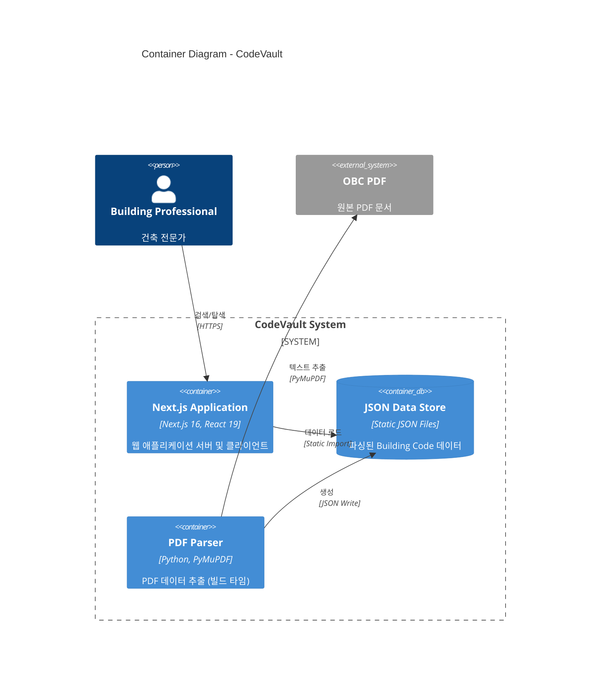
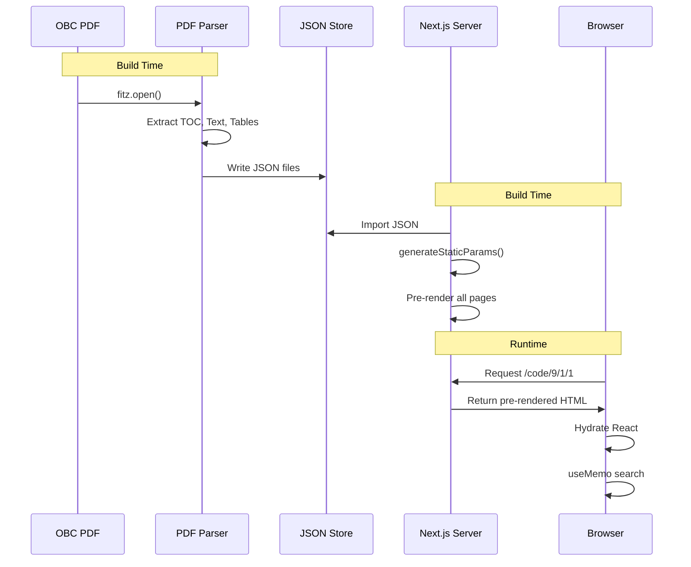

# Container Architecture (C4 Level 2)

> 시스템을 구성하는 컨테이너(배포 가능한 단위)와 그 관계

---

## Container Diagram



### Text Representation

```
┌─────────────────────────────────────────────────────────────────────────────┐
│                           CodeVault System                                   │
├─────────────────────────────────────────────────────────────────────────────┤
│                                                                              │
│  ┌──────────────┐                                                           │
│  │   Building   │                                                           │
│  │ Professional │                                                           │
│  └──────┬───────┘                                                           │
│         │ HTTPS                                                             │
│         ▼                                                                   │
│  ┌────────────────────────────────────────────────────────────────────┐    │
│  │                      RUNTIME CONTAINERS                             │    │
│  │  ┌──────────────────────────────────────────────────────────────┐  │    │
│  │  │               Next.js 16 Application                          │  │    │
│  │  │  ┌─────────────────┐    ┌─────────────────────────────────┐  │  │    │
│  │  │  │  Server         │    │  Client                          │  │  │    │
│  │  │  │  (Node.js)      │    │  (Browser)                       │  │  │    │
│  │  │  │  - SSG Pages    │───▶│  - React Components             │  │  │    │
│  │  │  │  - Static       │    │  - Client-side Search           │  │  │    │
│  │  │  │    Generation   │    │  - KaTeX Rendering              │  │  │    │
│  │  │  └─────────────────┘    └─────────────────────────────────┘  │  │    │
│  │  └──────────────────────────────────────────────────────────────┘  │    │
│  │                             │                                       │    │
│  │                             │ Static Import                         │    │
│  │                             ▼                                       │    │
│  │  ┌──────────────────────────────────────────────────────────────┐  │    │
│  │  │                   JSON Data Store                             │  │    │
│  │  │  ┌────────────┐ ┌────────────────┐ ┌─────────┐ ┌──────────┐  │  │    │
│  │  │  │part9.json  │ │part9-index.json│ │toc.json │ │tables.json│ │  │    │
│  │  │  │(Full Data) │ │(Search Index)  │ │(Nav TOC)│ │(HTML)     │  │  │    │
│  │  │  └────────────┘ └────────────────┘ └─────────┘ └──────────┘  │  │    │
│  │  └──────────────────────────────────────────────────────────────┘  │    │
│  └─────────────────────────────────────────────────────────────────────┘    │
│                                                                              │
│  ┌─────────────────────────────────────────────────────────────────────┐    │
│  │                      BUILD-TIME CONTAINERS                           │    │
│  │  ┌──────────────────────────────────────────────────────────────┐   │    │
│  │  │                    PDF Parser (Python)                        │   │    │
│  │  │  ┌────────────────┐                  ┌──────────────────┐    │   │    │
│  │  │  │ parse_obc_v2.py │────────────────▶│ extract_tables.py│    │   │    │
│  │  │  │ (Main Parser)   │                 │ (Table Parser)   │    │   │    │
│  │  │  └────────┬────────┘                 └──────────────────┘    │   │    │
│  │  │           │                                                   │   │    │
│  │  │           │ PyMuPDF                                           │   │    │
│  │  │           ▼                                                   │   │    │
│  │  │  ┌─────────────────┐                                         │   │    │
│  │  │  │   OBC PDF       │                                         │   │    │
│  │  │  │  (301880.pdf)   │                                         │   │    │
│  │  │  └─────────────────┘                                         │   │    │
│  │  └──────────────────────────────────────────────────────────────┘   │    │
│  └──────────────────────────────────────────────────────────────────────┘   │
│                                                                              │
└──────────────────────────────────────────────────────────────────────────────┘
```

---

## Container Details

### 1. Next.js Application

| 속성 | 값 |
|------|-----|
| **Technology** | Next.js 16.1.2, React 19.2.3, TypeScript 5 |
| **Deployment** | Vercel / Static Export |
| **Port** | 3001 (development) |
| **Responsibilities** | 웹 UI 렌더링, 라우팅, 검색, 수식 렌더링 |

#### Sub-components

| Component | Type | Responsibility |
|-----------|------|----------------|
| Server (Node.js) | Build-time | SSG, Static Generation, Asset Bundling |
| Client (Browser) | Runtime | React Rendering, Search, Interaction |

### 2. JSON Data Store

| 속성 | 값 |
|------|-----|
| **Location** | `codevault/public/data/` |
| **Format** | Static JSON Files |
| **Access** | Static Import / Fetch |

#### Data Files

| File | Size | Purpose |
|------|------|---------|
| `part9.json` | ~2MB | 전체 Part 9 계층 구조 및 콘텐츠 |
| `part9-index.json` | ~500KB | 검색 인덱스 (서브섹션 레벨) |
| `toc.json` | ~50KB | 사이드바 목차 트리 |
| `part9_tables.json` | ~100KB | HTML 테이블 데이터 |

### 3. PDF Parser (Build-time)

| 속성 | 값 |
|------|-----|
| **Technology** | Python 3.x, PyMuPDF >= 1.24.0 |
| **Location** | `scripts_temp/` |
| **Execution** | Manual (빌드 전 실행) |
| **Input** | OBC PDF (301880.pdf) |
| **Output** | JSON Files |

---

## Data Flow Between Containers



---

## Runtime vs Build-time

### Build-time Processes

```
1. PDF Parsing (Manual)
   python parse_obc_v2.py
   ├── Input: source/301880.pdf
   └── Output: public/data/*.json

2. Next.js Build
   npm run build
   ├── generateStaticParams() → pre-render all /code/* pages
   ├── Bundle JSON data
   └── Output: .next/ directory
```

### Runtime Processes

```
1. Page Load
   User requests /code/9/1/1
   ├── Server returns pre-rendered HTML
   └── Client hydrates React components

2. Client-side Search
   User types query
   ├── searchCode() filters part9-index.json
   └── Results displayed immediately
```

---

## Technology Choices

| Container | Choice | Reason |
|-----------|--------|--------|
| Web Framework | Next.js 16 | React 19 지원, SSG, 최신 App Router |
| UI Library | React 19 | Concurrent features, Server Components |
| Styling | Tailwind CSS v4 | Utility-first, 빠른 개발, 작은 번들 |
| Math Rendering | KaTeX | MathJax보다 빠름, 작은 번들 크기 |
| PDF Parsing | PyMuPDF | 빠른 성능, 신뢰성 있는 텍스트 추출 |
| Data Format | JSON | JavaScript 네이티브, 파싱 불필요 |

---

## Scalability Considerations

### Current Architecture (Static)

```
┌─────────┐     ┌─────────┐     ┌─────────────┐
│  User   │────▶│   CDN   │────▶│ Static HTML │
└─────────┘     └─────────┘     └─────────────┘
```

- **장점**: 무한 확장, 저비용, 빠른 응답
- **제한**: 동적 기능 불가, 데이터 업데이트 시 재빌드 필요

### Future Architecture (Optional)

```
┌─────────┐     ┌─────────┐     ┌─────────────┐
│  User   │────▶│   API   │────▶│  Database   │
└─────────┘     └─────────┘     └─────────────┘
```

- 필요 시 API Routes 추가 가능
- 검색 엔진 (Elasticsearch, Algolia) 통합 가능

---

*이전 문서: [System Context](./01-system-context.md)*
*다음 문서: [Component Architecture](./03-component-architecture.md)*
