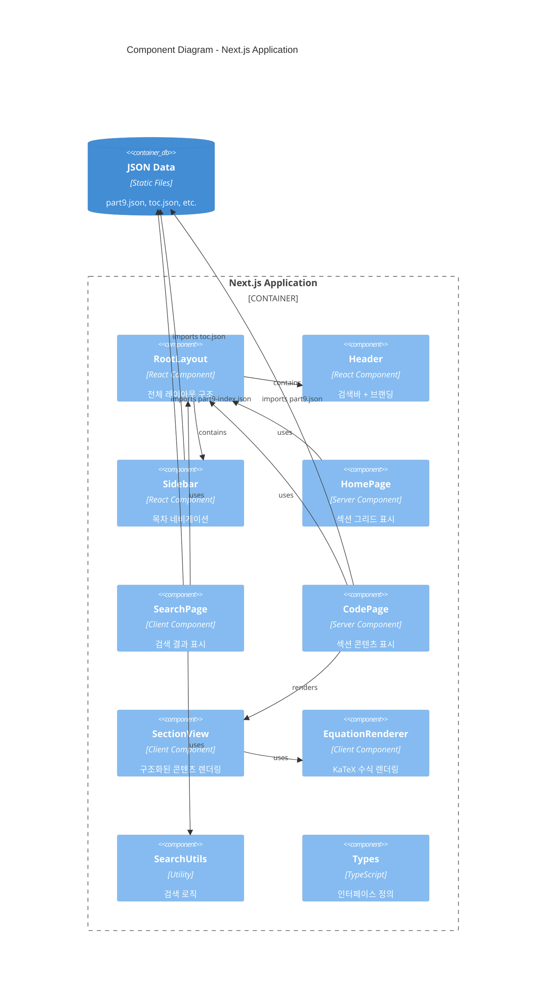
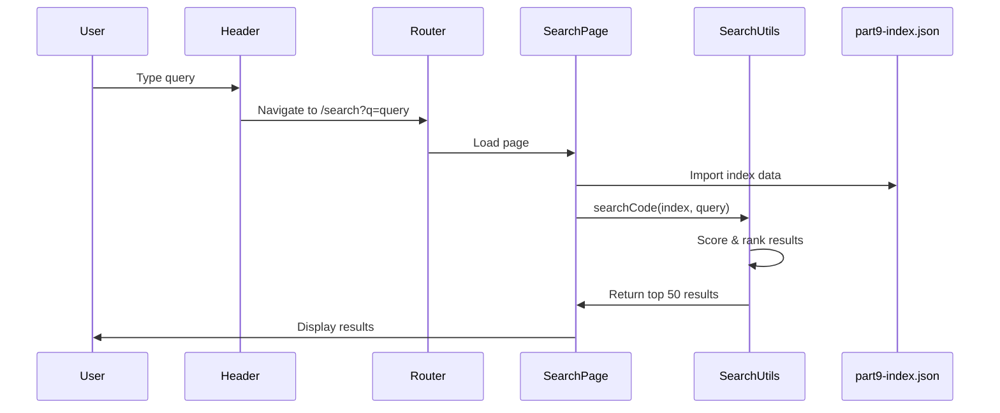
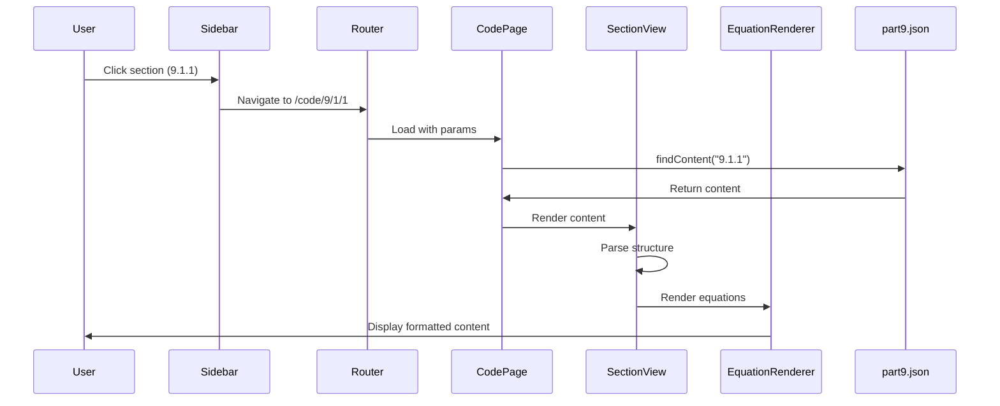

# Component Architecture (C4 Level 3)

> Next.js 애플리케이션 내부 컴포넌트 구조와 관계

---

## Component Diagram



### Text Representation

```
┌────────────────────────────────────────────────────────────────────────────────┐
│                        Next.js Application Components                           │
├────────────────────────────────────────────────────────────────────────────────┤
│                                                                                 │
│  ┌─────────────────────────────────────────────────────────────────────────┐   │
│  │                         RootLayout (layout.tsx)                          │   │
│  │  ┌─────────────────────────────────────────────────────────────────┐    │   │
│  │  │                                                                  │    │   │
│  │  │  ┌───────────────────────────────────────────────────────────┐  │    │   │
│  │  │  │                    Header Component                        │  │    │   │
│  │  │  │  [Logo] [Search Input                    ] [Search Icon]   │  │    │   │
│  │  │  └───────────────────────────────────────────────────────────┘  │    │   │
│  │  │                                                                  │    │   │
│  │  │  ┌──────────────┐  ┌──────────────────────────────────────────┐ │    │   │
│  │  │  │   Sidebar    │  │              Main Content                 │ │    │   │
│  │  │  │              │  │                                           │ │    │   │
│  │  │  │  ▼ Part 9    │  │  ┌─────────────────────────────────────┐ │ │    │   │
│  │  │  │    ▼ 9.1     │  │  │     Page Component                  │ │ │    │   │
│  │  │  │      9.1.1   │  │  │  ┌───────────────────────────────┐  │ │ │    │   │
│  │  │  │      9.1.2   │  │  │  │  HomePage / SearchPage /      │  │ │ │    │   │
│  │  │  │    ▼ 9.2     │  │  │  │  CodePage[...section]         │  │ │ │    │   │
│  │  │  │    ▼ 9.3     │  │  │  │                               │  │ │ │    │   │
│  │  │  │    ...       │  │  │  │  ┌─────────────────────────┐  │  │ │ │    │   │
│  │  │  │              │  │  │  │  │    SectionView          │  │  │ │ │    │   │
│  │  │  │              │  │  │  │  │  ┌───────────────────┐  │  │  │ │ │    │   │
│  │  │  │              │  │  │  │  │  │EquationRenderer  │  │  │  │ │ │    │   │
│  │  │  │              │  │  │  │  │  └───────────────────┘  │  │  │ │ │    │   │
│  │  │  │              │  │  │  │  └─────────────────────────┘  │  │ │ │    │   │
│  │  │  │              │  │  │  └───────────────────────────────┘  │ │ │    │   │
│  │  │  │              │  │  └─────────────────────────────────────┘ │ │    │   │
│  │  │  └──────────────┘  └──────────────────────────────────────────┘ │    │   │
│  │  │                                                                  │    │   │
│  │  └──────────────────────────────────────────────────────────────────┘   │   │
│  └─────────────────────────────────────────────────────────────────────────┘   │
│                                                                                 │
│  ┌─────────────────────────────────────────────────────────────────────────┐   │
│  │                            Utilities (lib/)                              │   │
│  │  ┌─────────────────────┐    ┌─────────────────────────────────────────┐ │   │
│  │  │      types.ts       │    │              search.ts                   │ │   │
│  │  │  - TocItem          │    │  - searchCode()                          │ │   │
│  │  │  - Part             │    │  - highlightText()                       │ │   │
│  │  │  - Section          │    │  - getSnippet()                          │ │   │
│  │  │  - Subsection       │    │  - escapeRegex()                         │ │   │
│  │  │  - Article          │    │                                          │ │   │
│  │  │  - SearchItem       │    │                                          │ │   │
│  │  └─────────────────────┘    └─────────────────────────────────────────┘ │   │
│  └─────────────────────────────────────────────────────────────────────────┘   │
│                                                                                 │
└────────────────────────────────────────────────────────────────────────────────┘
```

---

## Component Details

### 1. Layout Components

#### RootLayout (`src/app/layout.tsx`)

```typescript
// 역할: 전체 페이지 구조 정의
// 타입: Server Component
// 크기: 43 lines

export default function RootLayout({ children }) {
  return (
    <html>
      <body>
        <Header />
        <div className="flex">
          <Sidebar toc={tocData} />
          <main>{children}</main>
        </div>
      </body>
    </html>
  );
}
```

| Props | Type | Description |
|-------|------|-------------|
| children | ReactNode | 페이지 콘텐츠 |

#### Header (`src/components/layout/Header.tsx`)

```typescript
// 역할: 검색바와 브랜딩
// 타입: Client Component ("use client")
// 크기: 60 lines
```

| Feature | Implementation |
|---------|----------------|
| 검색 폼 | `<form>` with `action="/search"` |
| 검색 입력 | Controlled input with `useState` |
| 브랜딩 | 로고 + "CodeVault" 텍스트 |
| 스타일 | Fixed position, z-50, h-14 |

#### Sidebar (`src/components/layout/Sidebar.tsx`)

```typescript
// 역할: 계층적 목차 네비게이션
// 타입: Client Component ("use client")
// 크기: 90 lines
```

| Feature | Implementation |
|---------|----------------|
| 트리 구조 | Recursive `TocNode` component |
| 확장/축소 | `useState` for expanded state |
| 활성 표시 | `usePathname()` 매칭 |
| 아이콘 | Chevron (▶/▼) |

---

### 2. Page Components

#### HomePage (`src/app/page.tsx`)

```typescript
// 역할: 홈페이지 - 섹션 그리드 표시
// 타입: Server Component
// 크기: 42 lines
// Route: /
```

| Feature | Implementation |
|---------|----------------|
| 데이터 | Static import of `toc.json` |
| 레이아웃 | CSS Grid (3 columns) |
| 링크 | `<Link href="/code/{section.id}">` |

#### SearchPage (`src/app/search/page.tsx`)

```typescript
// 역할: 검색 결과 표시
// 타입: Client Component ("use client")
// 크기: 75 lines
// Route: /search?q={query}
```

| Feature | Implementation |
|---------|----------------|
| 쿼리 파라미터 | `useSearchParams()` |
| 검색 로직 | `useMemo` + `searchCode()` |
| 결과 제한 | 최대 50개 |
| 하이라이트 | `highlightText()` |

#### CodePage (`src/app/code/[...section]/page.tsx`)

```typescript
// 역할: 빌딩 코드 섹션 콘텐츠 표시
// 타입: Server Component
// 크기: 62 lines
// Route: /code/[...section] (catch-all)
```

| Feature | Implementation |
|---------|----------------|
| 동적 라우트 | `[...section]` catch-all |
| Static 생성 | `generateStaticParams()` |
| 콘텐츠 조회 | `findContent()` helper |
| 렌더링 | `<SectionView content={...} />` |

---

### 3. Content Components

#### SectionView (`src/components/code/SectionView.tsx`)

```typescript
// 역할: 구조화된 빌딩 코드 콘텐츠 렌더링
// 타입: Client Component ("use client")
// 크기: 187 lines
```

**텍스트 파싱 로직:**

```
┌─────────────────────────────────────────────────────────┐
│ Input: Raw content text                                 │
│ "9.1.1.1. Application\n(1) This Part applies to..."    │
├─────────────────────────────────────────────────────────┤
│                         ↓                               │
│              Pattern Matching                           │
├─────────────────────────────────────────────────────────┤
│ Article   │ /^(\d+\.\d+\.\d+\.\d+\.)\s*(.*)$/          │ → <h4>
│ Subsection│ /^(\d+\.\d+\.\d+\.)\s*(.*)$/               │ → <h3>
│ Clause    │ /^\((\d+)\)\s*(.*)$/                       │ → <div>
│ Subclause │ /^\s*\(([a-z])\)\s*(.*)$/                  │ → <div class="ml-4">
│ Roman     │ /^\s*\((i{1,3}|iv|v|vi{0,3})\)\s*(.*)$/    │ → <div class="ml-8">
│ Table     │ /Table\s+\d+\.\d+\.\d+\.\d+\./             │ → <TableHTML>
├─────────────────────────────────────────────────────────┤
│                         ↓                               │
│ Output: Structured JSX with styling                     │
└─────────────────────────────────────────────────────────┘
```

#### EquationRenderer (`src/components/code/EquationRenderer.tsx`)

```typescript
// 역할: 수학 공식을 KaTeX로 렌더링
// 타입: Client Component ("use client")
// 크기: 211 lines
```

**변환 패턴:**

| Input | Output (LaTeX) | Description |
|-------|----------------|-------------|
| `R = 1/U` | `R = \frac{1}{U}` | 분수 |
| `5°C` | `5°\text{C}` | 온도 |
| `m²` | `\text{m}^2` | 제곱 단위 |
| `alpha` | `\alpha` | 그리스 문자 |
| `A_1` | `A_1` | 아래첨자 |

**Exports:**

```typescript
export function hasEquation(text: string): boolean;
export function textToLatex(text: string): string;
export function renderKatex(latex: string): string;
```

---

### 4. Utility Modules

#### Types (`src/lib/types.ts`)

```typescript
// 인터페이스 정의
export interface TocItem {
  id: string;
  title: string;
  children: TocItem[];
}

export interface Part {
  id: string;
  title: string;
  sections: Section[];
}

export interface Section {
  id: string;
  title: string;
  page: number;
  subsections: Subsection[];
}

export interface Subsection {
  id: string;
  title: string;
  page: number;
  content: string;
  articles: Article[];
}

export interface Article {
  id: string;
  title: string;
  content: string;
}

export interface SearchItem {
  id: string;
  title: string;
  section: string;
  sectionId: string;
  content: string;
  page: number;
  path: string;
}
```

#### Search Utils (`src/lib/search.ts`)

```typescript
// 검색 알고리즘
export function searchCode(
  index: SearchItem[],
  query: string,
  limit: number = 50
): SearchItem[];

// 점수 계산
// ID 정확히 일치: +100
// ID 포함: +50
// 제목 매치: +30
// 내용 매치: +10 (발생당 +2, 최대 10)

export function highlightText(text: string, query: string): string;
export function getSnippet(content: string, query: string, maxLength: number): string;
export function escapeRegex(string: string): string;
```

---

## Component Interaction Flow

### Search Flow



### Content View Flow



---

## File Structure Summary

```
src/
├── app/
│   ├── layout.tsx           # Root layout (Server)
│   ├── page.tsx             # Home page (Server)
│   ├── globals.css          # Global styles
│   ├── search/
│   │   └── page.tsx         # Search results (Client)
│   └── code/
│       └── [...section]/
│           └── page.tsx     # Code viewer (Server)
├── components/
│   ├── layout/
│   │   ├── Header.tsx       # Search header (Client)
│   │   └── Sidebar.tsx      # TOC navigation (Client)
│   └── code/
│       ├── SectionView.tsx  # Content renderer (Client)
│       └── EquationRenderer.tsx  # KaTeX renderer (Client)
└── lib/
    ├── types.ts             # TypeScript interfaces
    └── search.ts            # Search utilities
```

---

*이전 문서: [Container Architecture](./02-container-architecture.md)*
*다음 문서: [Data Architecture](./04-data-architecture.md)*
