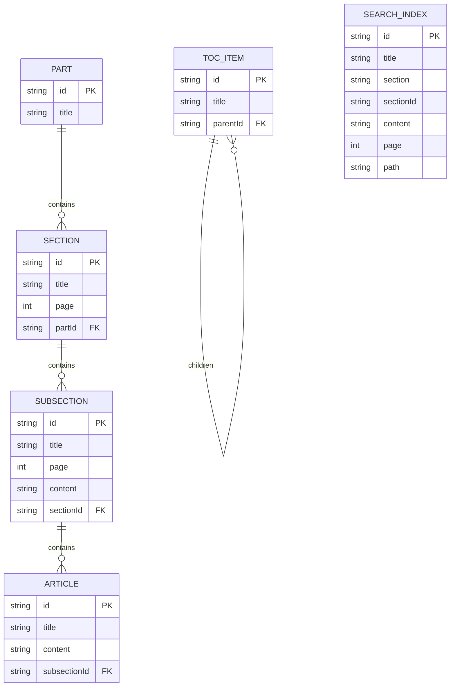

# Data Architecture

> 데이터 모델, 흐름, 저장소 구조

---

## Data Flow Overview

```
┌─────────────────────────────────────────────────────────────────────────────────┐
│                           DATA PIPELINE                                          │
├─────────────────────────────────────────────────────────────────────────────────┤
│                                                                                  │
│  ┌──────────────┐                                                               │
│  │   SOURCE     │                                                               │
│  │  OBC PDF     │                                                               │
│  │ 301880.pdf   │                                                               │
│  └──────┬───────┘                                                               │
│         │                                                                        │
│         │ PyMuPDF fitz.open()                                                   │
│         ▼                                                                        │
│  ┌──────────────────────────────────────────────────────────────────────────┐   │
│  │                        PDF PARSER (Python)                                │   │
│  │  ┌────────────────┐  ┌────────────────┐  ┌────────────────────────────┐  │   │
│  │  │ get_toc_part9()│  │extract_page_   │  │ build_structure()          │  │   │
│  │  │ TOC 추출       │  │text()          │  │ 계층 구조 생성              │  │   │
│  │  └────────────────┘  │ 텍스트 추출    │  └────────────────────────────┘  │   │
│  │                      └────────────────┘                                   │   │
│  └──────────────────────────────────────────────────────────────────────────┘   │
│         │                                                                        │
│         │ JSON Write                                                            │
│         ▼                                                                        │
│  ┌──────────────────────────────────────────────────────────────────────────┐   │
│  │                        JSON DATA STORE                                    │   │
│  │  ┌─────────────┐  ┌────────────────┐  ┌─────────┐  ┌─────────────────┐   │   │
│  │  │ part9.json  │  │part9-index.json│  │toc.json │  │part9_tables.json│   │   │
│  │  │   ~2MB      │  │    ~500KB      │  │  ~50KB  │  │    ~100KB       │   │   │
│  │  │ Full Data   │  │ Search Index   │  │  TOC    │  │  HTML Tables    │   │   │
│  │  └──────┬──────┘  └───────┬────────┘  └────┬────┘  └────────┬────────┘   │   │
│  └─────────│─────────────────│────────────────│────────────────│────────────┘   │
│            │                 │                │                │                 │
│            │ Static Import   │ Static Import  │ Static Import  │ Fetch           │
│            ▼                 ▼                ▼                ▼                 │
│  ┌──────────────────────────────────────────────────────────────────────────┐   │
│  │                        NEXT.JS APPLICATION                                │   │
│  │  ┌─────────────┐  ┌────────────────┐  ┌─────────┐  ┌─────────────────┐   │   │
│  │  │  CodePage   │  │  SearchPage    │  │ Sidebar │  │  SectionView    │   │   │
│  │  │ findContent │  │  searchCode()  │  │ TocNode │  │  TableHTML      │   │   │
│  │  └─────────────┘  └────────────────┘  └─────────┘  └─────────────────┘   │   │
│  └──────────────────────────────────────────────────────────────────────────┘   │
│                                                                                  │
└──────────────────────────────────────────────────────────────────────────────────┘
```

---

## Data Models

### 1. Part (최상위)

```typescript
interface Part {
  id: string;        // "9"
  title: string;     // "Housing and Small Buildings"
  sections: Section[];
}
```

### 2. Section (섹션 레벨)

```typescript
interface Section {
  id: string;        // "9.10"
  title: string;     // "Means of Egress"
  page: number;      // 715
  subsections: Subsection[];
}
```

### 3. Subsection (서브섹션 레벨)

```typescript
interface Subsection {
  id: string;        // "9.10.1"
  title: string;     // "General"
  page: number;      // 720
  content: string;   // 전체 텍스트 콘텐츠
  articles: Article[];
}
```

### 4. Article (조문 레벨)

```typescript
interface Article {
  id: string;        // "9.10.1.1"
  title: string;     // "Application"
  content: string;   // 조문 내용
}
```

### 5. TocItem (목차 네비게이션)

```typescript
interface TocItem {
  id: string;        // "9.10"
  title: string;     // "Means of Egress"
  children: TocItem[];  // 하위 항목 (재귀)
}
```

### 6. SearchItem (검색 인덱스)

```typescript
interface SearchItem {
  id: string;        // "9.10.1"
  title: string;     // "General"
  section: string;   // "Means of Egress"
  sectionId: string; // "9.10"
  content: string;   // 검색용 콘텐츠 (1000자 제한)
  page: number;      // 720
  path: string;      // "/code/9/10/1"
}
```

---

## Entity Relationship Diagram



---

## JSON File Structures

### 1. part9.json (Full Data)

```json
{
  "id": "9",
  "title": "Housing and Small Buildings",
  "sections": [
    {
      "id": "9.1",
      "title": "General",
      "page": 715,
      "subsections": [
        {
          "id": "9.1.1",
          "title": "Application",
          "page": 715,
          "content": "9.1.1. Application\n9.1.1.1. Application...",
          "articles": [
            {
              "id": "9.1.1.1",
              "title": "Application",
              "content": "(1) This Part applies to..."
            }
          ]
        }
      ]
    }
  ]
}
```

### 2. part9-index.json (Search Index)

```json
[
  {
    "id": "9.1.1",
    "title": "Application",
    "section": "General",
    "sectionId": "9.1",
    "content": "This Part applies to the construction, alteration...",
    "page": 715,
    "path": "/code/9/1/1"
  }
]
```

### 3. toc.json (Navigation)

```json
[
  {
    "id": "9",
    "title": "Part 9 - Housing and Small Buildings",
    "children": [
      {
        "id": "9.1",
        "title": "General",
        "children": [
          {
            "id": "9.1.1",
            "title": "Application",
            "children": []
          }
        ]
      }
    ]
  }
]
```

### 4. part9_tables.json (HTML Tables)

```json
{
  "9.10.3.1.": {
    "id": "9.10.3.1.",
    "html": "<table class=\"obc-table\">...</table>",
    "caption": "Table 9.10.3.1. Required Headroom"
  }
}
```

---

## Data Transformation Pipeline

### Stage 1: PDF Extraction

```python
# parse_obc_v2.py

def get_toc_part9(doc):
    """PDF TOC에서 Part 9 항목 추출"""
    toc = doc.get_toc()
    part9_entries = []
    for level, title, page in toc:
        if title.startswith("9.") or "Part 9" in title:
            part9_entries.append((level, title, page))
    return part9_entries
```

### Stage 2: Text Processing

```python
def extract_page_text(doc, page_num):
    """페이지 텍스트 추출 (헤더/푸터 제거)"""
    page = doc[page_num]
    text = page.get_text()
    # 헤더 제거
    text = re.sub(r'^.*Ontario Building Code.*$', '', text, flags=re.MULTILINE)
    # 페이지 번호 제거
    text = re.sub(r'^\d+$', '', text, flags=re.MULTILINE)
    return text.strip()
```

### Stage 3: Structure Building

```python
def build_structure(toc_items, doc):
    """계층 구조 생성"""
    part = {"id": "9", "title": "Housing and Small Buildings", "sections": []}

    current_section = None
    current_subsection = None

    for level, title, page in toc_items:
        parsed = parse_article_id(title)
        parts = parsed["id"].count(".")

        if parts == 1:  # Section (9.10)
            current_section = {...}
            part["sections"].append(current_section)
        elif parts == 2:  # Subsection (9.10.1)
            current_subsection = {...}
            current_section["subsections"].append(current_subsection)

    return part
```

### Stage 4: Index Generation

```python
def create_search_index(data):
    """검색 인덱스 생성"""
    index = []
    for section in data["sections"]:
        for subsection in section["subsections"]:
            index.append({
                "id": subsection["id"],
                "title": subsection["title"],
                "section": section["title"],
                "sectionId": section["id"],
                "content": subsection["content"][:1000],  # 1000자 제한
                "page": subsection["page"],
                "path": f"/code/{subsection['id'].replace('.', '/')}"
            })
    return index
```

---

## Data Access Patterns

### Pattern 1: Full Content Lookup

```typescript
// CodePage에서 사용
import partData from '@/public/data/part9.json';

function findContent(sectionId: string): Subsection | null {
  const parts = sectionId.split('.');

  // 섹션 찾기
  const section = partData.sections.find(s => s.id === `${parts[0]}.${parts[1]}`);
  if (!section) return null;

  // 서브섹션 찾기
  const subsection = section.subsections.find(ss => ss.id === sectionId);
  return subsection;
}
```

### Pattern 2: Search

```typescript
// SearchPage에서 사용
import index from '@/public/data/part9-index.json';

const results = useMemo(() => {
  return searchCode(index, query);
}, [query]);
```

### Pattern 3: Navigation Tree

```typescript
// Sidebar에서 사용
import toc from '@/public/data/toc.json';

function TocNode({ item }: { item: TocItem }) {
  return (
    <div>
      <Link href={`/code/${item.id}`}>{item.title}</Link>
      {item.children.map(child => (
        <TocNode key={child.id} item={child} />
      ))}
    </div>
  );
}
```

---

## Data Validation

### ID Format Validation

```typescript
// 유효한 ID 형식
const ID_PATTERNS = {
  section: /^\d+\.\d+$/,        // 9.10
  subsection: /^\d+\.\d+\.\d+$/, // 9.10.1
  article: /^\d+\.\d+\.\d+\.\d+$/ // 9.10.1.1
};

function validateId(id: string, level: keyof typeof ID_PATTERNS): boolean {
  return ID_PATTERNS[level].test(id);
}
```

### Content Integrity

```typescript
// 데이터 무결성 검사
interface ValidationResult {
  valid: boolean;
  errors: string[];
}

function validatePartData(data: Part): ValidationResult {
  const errors: string[] = [];

  // 섹션이 있는지 확인
  if (!data.sections || data.sections.length === 0) {
    errors.push("No sections found");
  }

  // 빈 콘텐츠 확인
  for (const section of data.sections) {
    for (const subsection of section.subsections) {
      if (!subsection.content || subsection.content.trim() === '') {
        errors.push(`Empty content: ${subsection.id}`);
      }
    }
  }

  return { valid: errors.length === 0, errors };
}
```

---

## Known Data Issues

| Issue | Status | Impact |
|-------|--------|--------|
| PDF 텍스트 순서 뒤섞임 | 알려진 문제 | 조문 번호 순서 불일치 |
| 섹션 경계 혼합 | 알려진 문제 | 9.2 내용이 9.3에 포함 |
| 빈 콘텐츠 | 알려진 문제 | 일부 서브섹션 내용 누락 |
| 테이블 추출 불완전 | 진행 중 | 복잡한 테이블 렌더링 문제 |

---

## Data Size Metrics

| File | Records | Size | Update Frequency |
|------|---------|------|------------------|
| part9.json | ~400 subsections | ~2MB | 빌드 시 |
| part9-index.json | ~400 entries | ~500KB | 빌드 시 |
| toc.json | ~100 nodes | ~50KB | 빌드 시 |
| part9_tables.json | ~50 tables | ~100KB | 빌드 시 |

---

*이전 문서: [Component Architecture](./03-component-architecture.md)*
*다음 문서: [Technology Stack](./05-technology-stack.md)*
